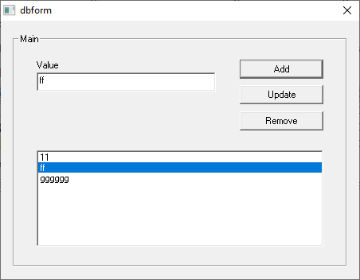

# dbform
A very simple database program for Win32 written in Assembly language

> [!NOTE]
>
> Currently UPDATE and DELETE database operations have bugs

Please compile with FASM. Must run with sqlite3.dll.
